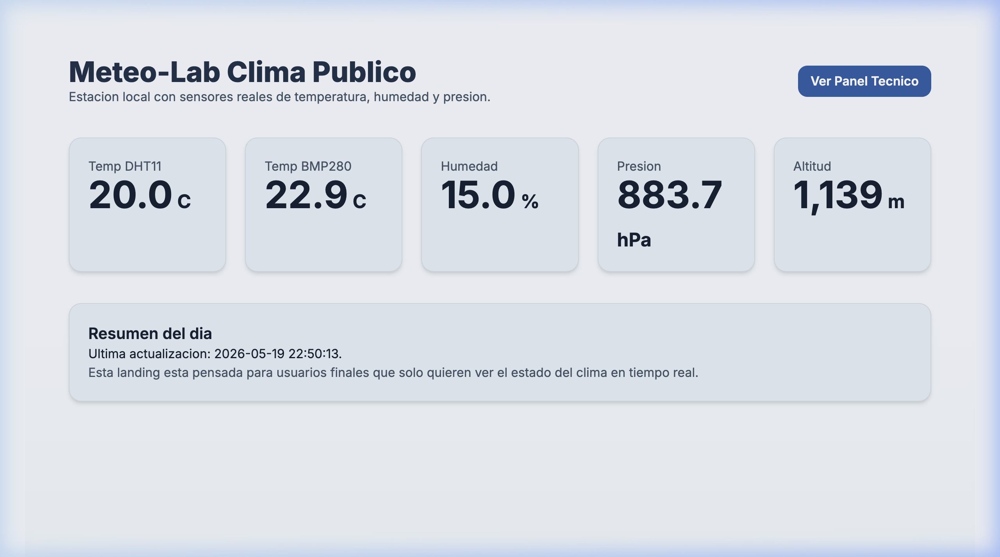
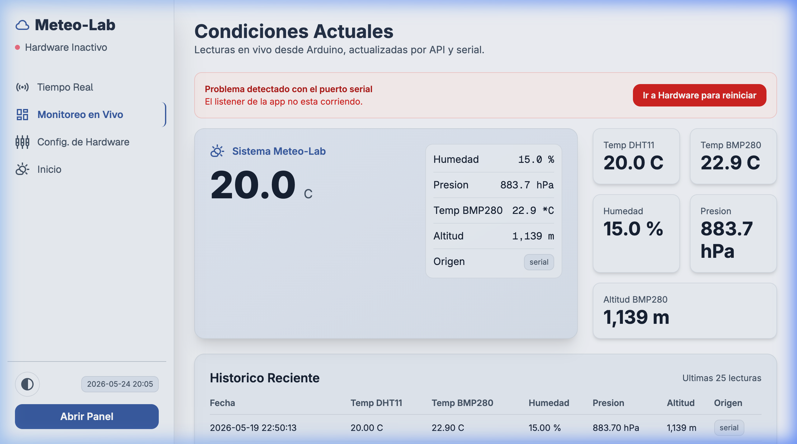
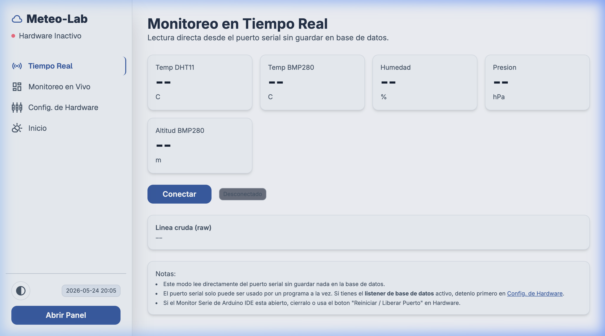
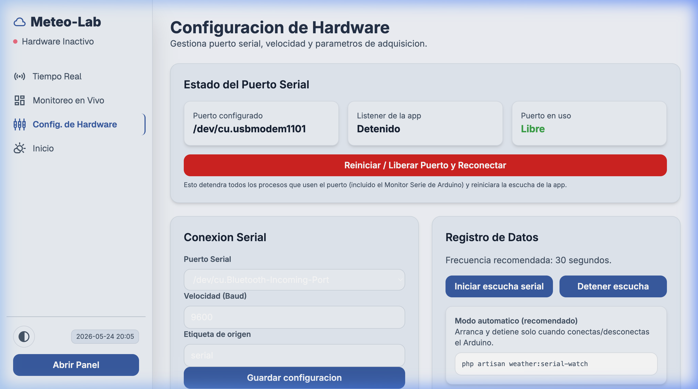

# Meteo-Lab / Clima Visor

Aplicacion web completa construida con **Laravel 13** para recibir, almacenar y visualizar datos de sensores meteorologicos conectados a un **Arduino**.

El sistema muestra en tiempo real la **temperatura** (DHT11 y BMP280), **humedad** (DHT11), **presion atmosferica** (BMP280) y **altitud aproximada** (BMP280), con graficas historicas, tablas paginadas y doble canal de ingesta de datos: **API REST** con token de seguridad y **puerto Serial** directo.

---

## ¿Que hace este proyecto?

Este proyecto es una estacion meteorologica digital que consta de dos partes:

1. **Firmware Arduino**: sensores DHT11 y BMP280 envian datos cada ~5-30 segundos por USB (Serial).
2. **Aplicacion Laravel**: recibe esos datos, los guarda en PostgreSQL y los presenta en un dashboard web interactivo.

### Funcionalidades principales

- **Landing publica** (`/`): muestra las ultimas lecturas de forma limpia para usuarios finales.
- **Panel tecnico** (`/monitor`): lecturas en vivo, historial paginado de las ultimas 25 lecturas, y grafica de las ultimas 5 horas.
- **Tiempo Real** (`/live`): lectura directa desde el puerto serial sin guardar en base de datos. Util para calibrar o probar el Arduino.
- **Configuracion de Hardware** (`/hardware`): detecta puertos seriales disponibles, permite seleccionar puerto/velocidad, iniciar/detener/reiniciar el listener serial, y liberar puertos ocupados.
- **Ingesta por API REST**: endpoint seguro con token para enviar datos desde cualquier cliente HTTP.
- **Ingesta por Serial Bus**: comando Artisan que escucha continuamente el puerto USB y guarda cada lectura en la base de datos.
- **Modo automatico** (`weather:serial-watch`): detecta cuando conectas/desconectas el Arduino y arranca o detiene el listener solo.

---

## Stack tecnologico

| Tecnologia | Version | Proposito |
|------------|---------|-----------|
| PHP | 8.3+ | Backend |
| Laravel | 13.x | Framework web |
| Livewire | 4.x | Componentes reactivos (usado por Mary UI) |
| Tailwind CSS | 4.x | Estilos utilitarios |
| Mary UI | 2.x | Componentes UI sobre Tailwind + Livewire |
| Alpine.js | 3.x | Interactividad ligera en el frontend |
| Vite | 6.x | Bundler de assets |
| PostgreSQL | 14+ | Base de datos relacional |
| Composer | 2.x | Dependencias PHP |
| Node.js | 20+ | Dependencias frontend |

---

## Requisitos previos

Antes de comenzar, asegurate de tener instalado en tu sistema:

- **PHP** 8.3 o superior (con extensiones: `pdo_pgsql`, `mbstring`, `openssl`, `json`, `fileinfo`)
- **Composer** (gestor de dependencias PHP)
- **Node.js** 20 o superior + **npm**
- **PostgreSQL** 14 o superior (servicio corriendo)
- **Git**
- Un usuario de PostgreSQL con permisos para crear bases de datos

> **Nota para macOS**: si usas Homebrew, tipicamente los puertos seriales de Arduino aparecen como `/dev/tty.usbmodem*` o `/dev/cu.usbmodem*`.

---

## Instalacion rapida (automatica)

Hemos incluido un script que automatiza toda la instalacion. Desde la raiz del proyecto ejecuta:

```bash
chmod +x setup.sh
./setup.sh
```

Este script hace lo siguiente automaticamente:
1. Verifica que tengas PHP, Composer, Node.js y PostgreSQL.
2. Copia `.env.example` a `.env` si no existe.
3. Genera la `APP_KEY` de Laravel.
4. Instala dependencias de Composer y npm.
5. Crea la base de datos si no existe.
6. Ejecuta las migraciones.
7. Compila los assets frontend con Vite.

Al finalizar, te indicara como levantar el proyecto.

---

## Instalacion manual (paso a paso)

Si prefieres hacerlo manualmente o el script falla, sigue estos pasos:

### 1. Clonar el repositorio

```bash
git clone git@github.com:tato1599/weatherstation.git
cd weatherstation
```

### 2. Instalar dependencias PHP

```bash
composer install
```

### 3. Configurar variables de entorno

```bash
cp .env.example .env
php artisan key:generate
```

Edita el archivo `.env` y configura al menos estos valores:

```env
# Aplicacion
APP_NAME="Meteo-Lab"
APP_URL=http://localhost:8000

# Base de datos (PostgreSQL)
DB_CONNECTION=pgsql
DB_HOST=127.0.0.1
DB_PORT=5432
DB_DATABASE=clima_visor
DB_USERNAME=tu_usuario_postgres
DB_PASSWORD=tu_contraseña

# Seguridad de ingesta
WEATHER_INGEST_TOKEN=tu-token-seguro-muy-largo

# Puerto serial del Arduino (ajusta segun tu sistema)
WEATHER_SERIAL_PORT=/dev/tty.usbmodem14101
WEATHER_SERIAL_BAUD=9600
```

### 4. Crear la base de datos

Desde psql o cualquier cliente PostgreSQL:

```sql
CREATE DATABASE clima_visor;
```

### 5. Ejecutar migraciones

```bash
php artisan migrate
```

### 6. Instalar dependencias frontend y compilar

```bash
npm install
npm run build
```

### 7. Levantar el servidor de desarrollo

```bash
composer run dev
```

Esto ejecuta simultaneamente:
- `php artisan serve` (servidor web en http://localhost:8000)
- `php artisan queue:listen` (colas en base de datos)
- `php artisan pail` (logs en tiempo real)
- `npm run dev` (servidor Vite con HMR)

Accede desde tu navegador a: **http://localhost:8000**

---

## Conectar el Arduino

### Requisitos de hardware

- Arduino UNO / Nano / compatible
- Sensor **DHT11** (temperatura y humedad)
- Sensor **BMP280** (temperatura, presion y altitud aproximada)
- Cable USB para conectar al ordenador

### Firmware del Arduino

El Arduino debe enviar datos por el puerto serial en uno de estos formatos:

**Formato recomendado (JSON):**
```json
{"temperature_c":24.2,"temperature_bmp280_c":26.7,"humidity_percent":55.1,"pressure_hpa":1012.3}
```

**Formato de texto (fallback):**
```
Humedad: 55.1 %	[DHT11] Temp: 24.2 *C	[BMP280] Temp: 26.7 *C	Presion: 1012.3 hPa	Altitud aprox: 1420 m
```

> La frecuencia recomendada de muestreo es de **30 segundos** entre lecturas.

### Detectar el puerto serial

En macOS/Linux:
```bash
ls /dev/tty.* /dev/cu.*
```

Tipicamente veras algo como `/dev/tty.usbmodem14101`. Actualiza `WEATHER_SERIAL_PORT` en tu `.env` o usala interfaz web en `/hardware` para seleccionarlo.

---

## Uso de la aplicacion

### Rutas principales

| Ruta | Descripcion |
|------|-------------|
| `/` | Landing publica con datos actuales |
| `/monitor` | Panel tecnico con historial y grafica |
| `/live` | Monitoreo en tiempo real directo del serial |
| `/hardware` | Configuracion del puerto serial y listener |

### Vistas y Funcionamiento en Detalle

#### 1. Landing Pública (`/`)
La **Landing Pública** es la puerta de entrada a la aplicación. Muestra de forma limpia, elegante y minimalista las lecturas meteorológicas actuales del sistema de un vistazo.
- **Métricas Clave**: Visualización en tiempo real de la temperatura (DHT11 y BMP280), humedad relativa, presión atmosférica y altitud aproximada.
- **Diseño Glassmorphic**: Desarrollada con DaisyUI y Tailwind CSS, ofrece una interfaz moderna que cautiva al usuario.
- **Acceso Directo**: Ideal para colocar en pantallas informativas o tablets de monitoreo doméstico.



---

#### 2. Panel Técnico / Monitor (`/monitor`)
El **Panel Técnico** es la consola de administración de datos donde los ingenieros y entusiastas pueden analizar los históricos registrados en la base de datos PostgreSQL/SQLite.
- **Indicadores de Estado**: Muestra de un vistazo el último registro capturado, su origen (API o Serial) y el tiempo transcurrido desde la última ingesta.
- **Gráficas en Tiempo Real**: Gráficas dinámicas e interactivas que detallan el comportamiento histórico de las variables del ambiente.
- **Historial Paginado**: Una tabla reactiva construida sobre Livewire que permite paginar las lecturas previas, auditar los metadatos JSON completos y ver marcas de tiempo exactas.



---

#### 3. Consola Serial en Vivo (`/live`)
La **Consola en Vivo** permite conectarse directamente al puerto serial del hardware (por ejemplo, el Arduino) sin guardar los datos en la base de datos de producción.
- **Calibración y Diagnóstico**: Perfecta para realizar tareas de mantenimiento, verificar que las tramas JSON que envía el microcontrolador tengan el formato correcto, y auditar ruido en la línea.
- **Terminal Web Interactiva**: Un stream dinámico de logs en vivo con formato de consola para una experiencia de depuración directa e inmediata.



---

#### 4. Panel de Configuración de Hardware (`/hardware`)
El centro neurálgico de control físico de la estación meteorológica. Desde aquí se administra la comunicación de bajo nivel entre el servidor Laravel y el microcontrolador Arduino.
- **Autodetectores de Puertos**: Muestra dinámicamente qué dispositivos de puerto serial USB/COM están conectados en el sistema (ideal para plataformas macOS y Linux).
- **Gestión del Demonio Serial**: Botones interactivos para **Iniciar**, **Detener**, **Reiniciar** y **Liberar** puertos del daemon de Laravel (`weather:serial-listen`) que escucha continuamente al hardware.
- **Configuración Dinámica**: Guarda la velocidad del puerto (Baud Rate) y el puerto asignado directamente en base de datos para no requerir modificar el `.env` constantemente.



---

### Ingesta por API REST

Envia datos desde cualquier cliente HTTP o script:

```bash
curl -X POST http://localhost:8000/api/v1/readings \
  -H "Content-Type: application/json" \
  -H "X-Weather-Token: tu-token-seguro-muy-largo" \
  -d '{
    "temperature_c": 24.7,
    "temperature_bmp280_c": 26.5,
    "humidity_percent": 58.4,
    "pressure_hpa": 1011.8,
    "recorded_at": "2026-05-18T16:30:00Z"
  }'
```

- `recorded_at` es opcional. Si no se envia, usa la hora actual del servidor.
- El token debe coincidir con `WEATHER_INGEST_TOKEN` en tu `.env`.

### Comandos Artisan disponibles

| Comando | Descripcion |
|---------|-------------|
| `php artisan weather:serial-listen` | Escucha el puerto serial y guarda lecturas en DB |
| `php artisan weather:serial-listen --port=/dev/tty.usbmodem1101 --baud=9600` | Escucha con puerto/baud especificos |
| `php artisan weather:serial-watch` | Modo automatico: detecta conexion/desconexion del Arduino |

---

## Estructura del proyecto (relevante)

```
weatherstation/
├── app/
│   ├── Console/Commands/
│   │   ├── WeatherSerialListen.php      # Listener del puerto serial
│   │   └── WeatherSerialWatch.php       # Watchdog automatico
│   ├── Http/
│   │   ├── Controllers/
│   │   │   ├── WeatherDashboardController.php    # Landing + Monitor + Hardware views
│   │   │   ├── WeatherReadingApiController.php # API de ingesta
│   │   │   ├── SerialLiveController.php         # Tiempo real
│   │   │   └── WeatherSettingsController.php   # Ajustes de hardware
│   │   └── Middleware/
│   │       └── EnsureIngestionToken.php         # Proteccion del API
│   ├── Models/
│   │   ├── WeatherReading.php             # Modelo de lecturas
│   │   └── AppSetting.php                 # Configuraciones dinamicas
│   └── Services/
│       ├── WeatherReadingIngestor.php     # Logica de guardar lecturas
│       └── SerialPortManager.php          # Gestión de puertos seriales
├── database/migrations/
│   ├── 2026_05_18_000100_create_weather_readings_table.php
│   ├── 2026_05_18_000110_create_app_settings_table.php
│   ├── 2026_05_19_175934_add_temperature_bmp280_c_to_weather_readings_table.php
│   └── 2026_05_19_181838_add_altitude_m_to_weather_readings_table.php
├── resources/views/
│   ├── landing.blade.php
│   ├── dashboard.blade.php
│   ├── live.blade.php
│   ├── hardware.blade.php
│   └── components/layouts/app.blade.php
├── routes/
│   ├── web.php
│   └── api.php
├── .env.example
├── composer.json
├── package.json
├── vite.config.js
└── setup.sh
```

---

## Solucion de problemas comunes

### Error: "Unable to open serial port"

- Verifica que el Arduino este conectado.
- Asegurate de que ningun otro programa use el puerto (Monitor Serie de Arduino IDE, terminal, etc.).
- En la interfaz web ve a **/hardware** y usa el boton **"Reiniciar / Liberar Puerto y Reconectar"**.

### Error: "El puerto esta ocupado por otro proceso"

- Usa el boton de reinicio en `/hardware` o corre manualmente:
  ```bash
  lsof /dev/tty.usbmodem*
  kill -9 <PID>
  ```

### No se ven datos en el dashboard

- Si usas la API, verifica que el `X-Weather-Token` sea correcto.
- Si usas serial, verifica que el listener este corriendo (`/hardware` muestra el estado).
- Revisa los logs: `php artisan pail` o `tail -f storage/logs/laravel.log`.

### Assets sin compilar (pagina sin estilos)

```bash
npm run build
```

---

## Licencia

MIT

---

## Autor

Creado por [@tato1599](https://github.com/tato1599)
